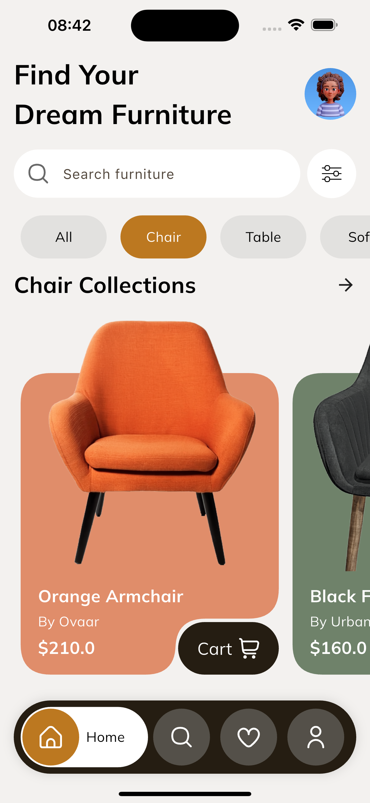
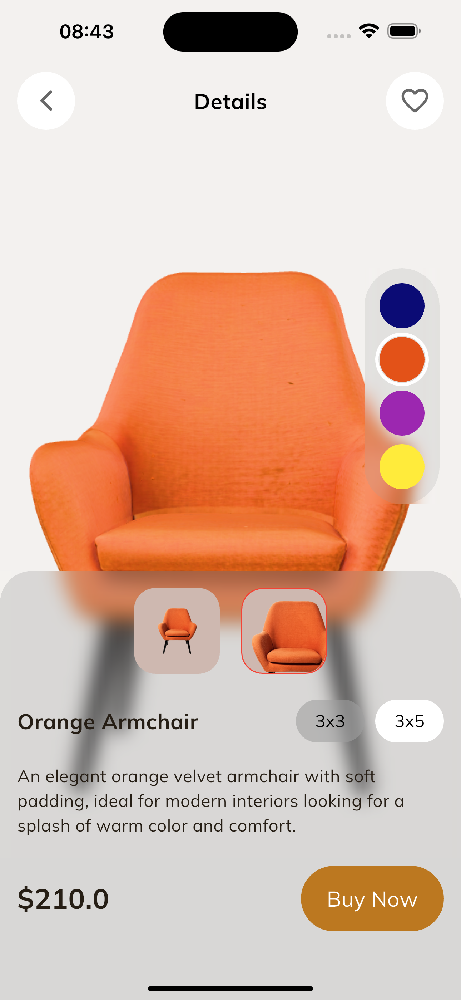

# 🪑 Ova Furniture – Flutter UI Prototype

Ova Furniture is a Flutter-based mobile prototype built by **Ovaar**.  
It was developed in just a few days from a static Dribbble mockup to demonstrate our ability to transform beautiful designs into real, smooth, and functional applications.

---

## 🧠 Why this prototype?

At **Ovaar**, we specialize in designing full-stack digital systems.  
While our core focus is smart and scalable backend development, we equally value user experience.

This project was created to:

- Showcase frontend proficiency using **Flutter**
- Prototype a real-world e-commerce furniture app from a **static design**
- Test UI responsiveness and animations in a production-like environment

---

## 🎨 Design & Image Sources

- 🎨 Design inspiration: https://dribbble.com/shots/26301079-Furniture-Shopping-App-Mobile-UI-UX-Design
- 🖼️ Images used in this app: https://fr.pinterest.com/

---

## 📸 Screenshots

<div align="center">
  
  
  
</div>

---

## 🚀 Key Objectives

- ✅ Deliver a functional mobile UI in record time
- ✅ Match the original mockup's layout, fonts, and color palette
- ✅ Integrate modern Flutter practices: custom widgets, page transitions, reusable components

---

## 📦 Getting Started

### Prerequisites

- Flutter SDK → https://docs.flutter.dev/get-started/install
- Dart (bundled with Flutter)
- Android Studio or VS Code
- Emulator or physical device

### Installation

1. Clone the project:
   git clone https://github.com/OvaarApp/ova-furniture.git

2. Get the dependencies:
   flutter pub get

3. Run the app:
   flutter run

---

## 🗂 Project Structure
```
lib/  
├── main.dart           # App entry point  
├── screens/            # All UI pages  
├── widgets/            # Custom components  
├── models/             # Data representations  
└── utils/              # Constants, helpers, themes
```
---

## 🙌 About Ovaar

We are a Togolese tech company focused on building full-stack digital solutions with efficiency and elegance.  
From backend architecture to frontend polish – we deliver fast, secure, and beautiful apps.

---
## 🔗 Contact & Links

- 🌐 Website: [ovaar.net](https://ovaar.net)
- 💼 LinkedIn: [Ovaar on LinkedIn](https://www.linkedin.com/company/ovaar)